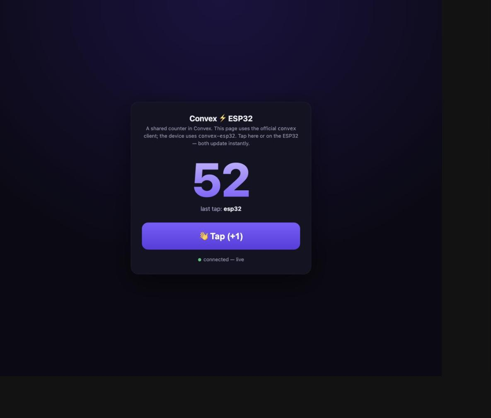

# Shared counter — ESP32 + web, one Convex deployment

A tiny end-to-end demo: a **shared counter** lives in a Convex deployment, and
both an **ESP32** (using `convex-esp32`) and a **web page** (using the official
`convex` client) connect to it. Tap the device's touchscreen or the web button —
the number goes up on **both, instantly**, over a WebSocket push (no polling).

<p align="center"></p>

Built and verified on an **ESP32-S3-Touch-LCD-1.54** (ST7789 240×240 + CST816
touch). The device shows the big count and "last tap" on the LCD; a tap fires a
mutation, and the reactive query pushes every change straight to the panel.

## The three pieces

```
backend/   a Convex deployment: board table + demo:get (query) + demo:tap (mutation)
device/    ESP32 firmware (PlatformIO): subscribes to demo:get, taps call demo:tap
web/       a single static HTML page using the official convex client (no build)
```

Everything is ~40 lines each. The whole reactive contract is: subscribe to
`demo:get`, call `demo:tap` — the server pushes the new value to every client.

## Run it

**1. Deploy the backend.**

```sh
cd backend
npm install
npx convex dev        # creates a deployment, prints its URL, keeps it live
```

Copy the deployment URL it prints (e.g. `https://your-deployment.convex.cloud`).

**2. Point the device and web at it.**

- `device/src/main.cpp`: set `CONVEX_URL`, `WIFI_SSID`, `WIFI_PASSWORD`.
- `web/index.html`: set `DEPLOYMENT`.

**3. Flash the device.**

```sh
cd device
pio run -t upload
```

**4. Open the web page.** Serve `web/` (e.g. `python3 -m http.server` inside it)
and open it — on your phone too, on the same Wi-Fi. Tap either side; both update
live.

## What it demonstrates

- `convexSubscribe("demo:get")` — a reactive query, delivered by server push.
- `convexMutation("demo:tap", "{\"who\":\"esp32\"}")` — a fire-and-forget
  mutation from a touch/button; the shared counter is transactional server-side,
  so concurrent taps from the device, the web, and anywhere else never lose a
  count.
- The device reads the latest value with the thread-safe cached poll
  (`convexQueryChanged`/`convexQueryValue`) in `loop()`; the web uses
  `client.onUpdate`.

Pins for the 1.54 board are taken from
[Waveshare's example](https://github.com/waveshareteam/ESP32-S3-Touch-LCD-1.54)
(LCD DC 45 / CS 21 / SCK 38 / MOSI 39 / RST 40 / BL 46; touch I²C SDA 42 / SCL 41).
